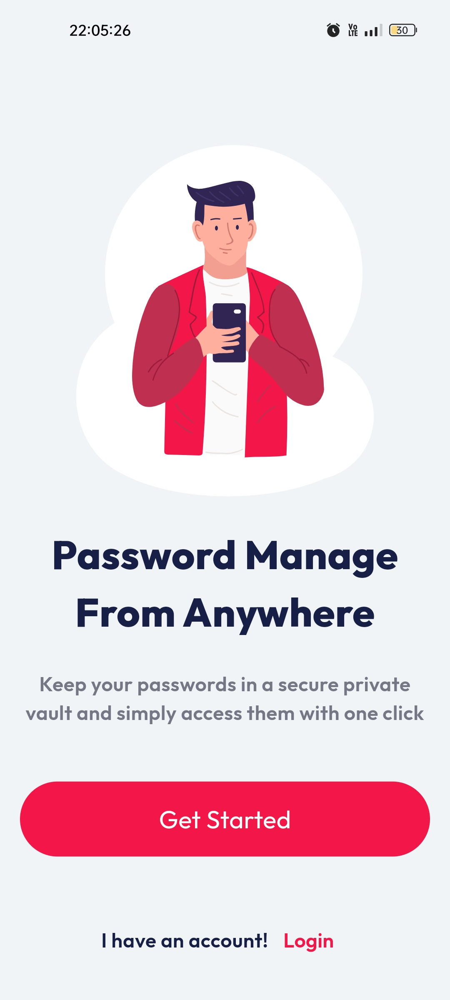
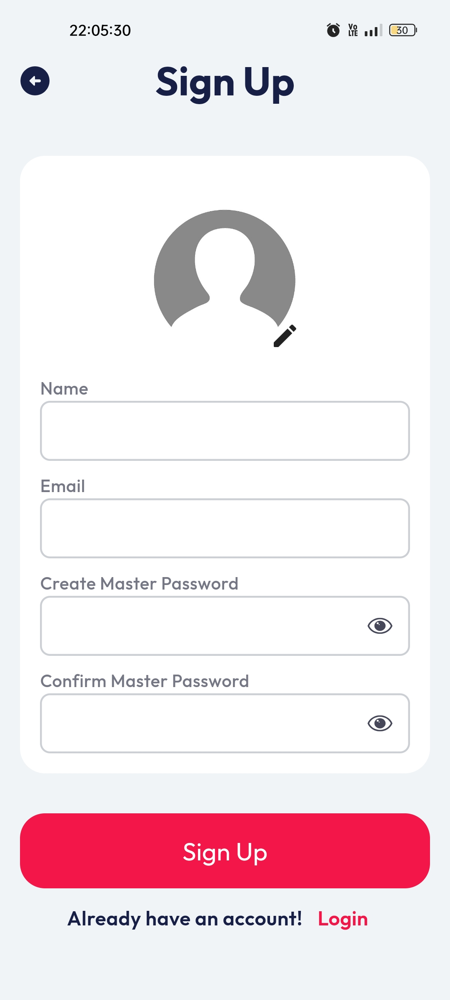
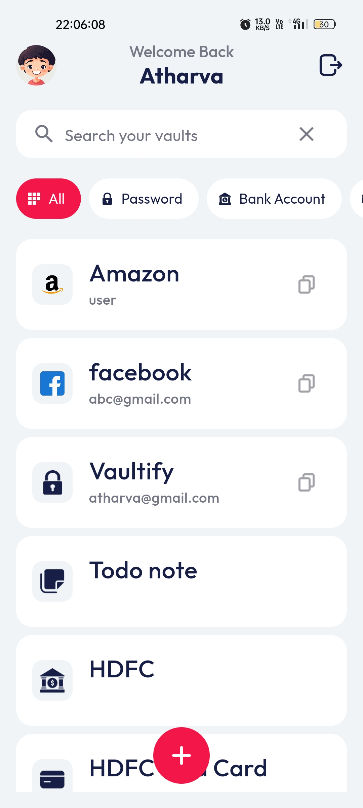
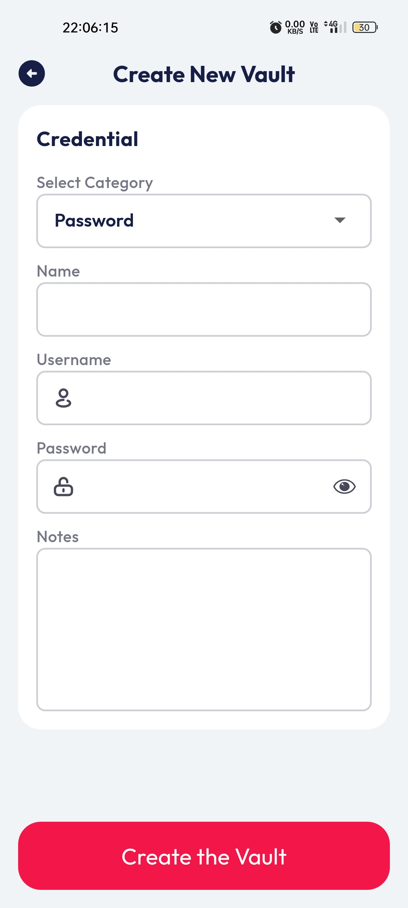
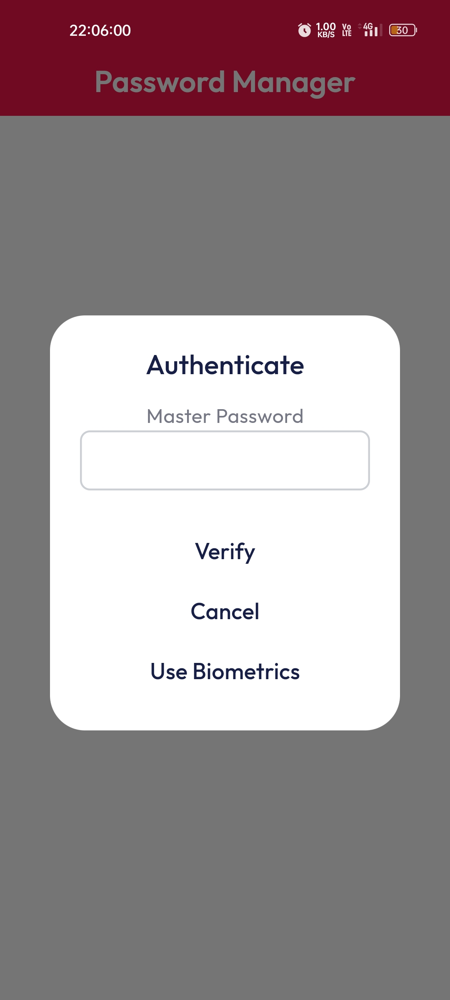
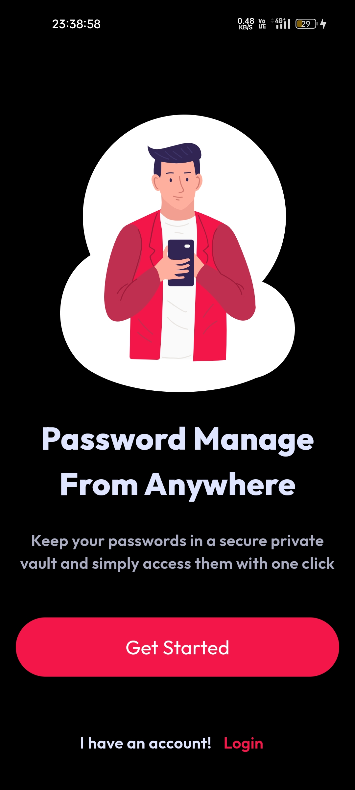
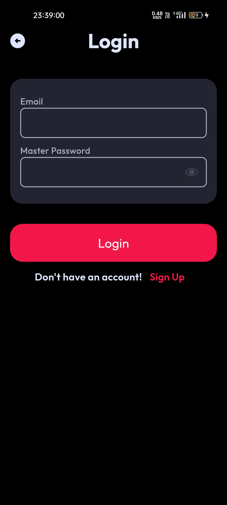
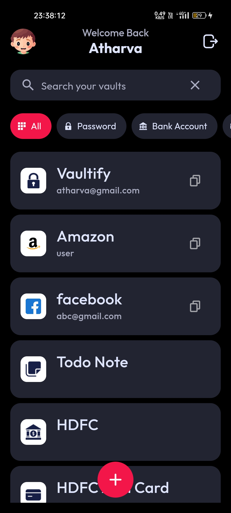
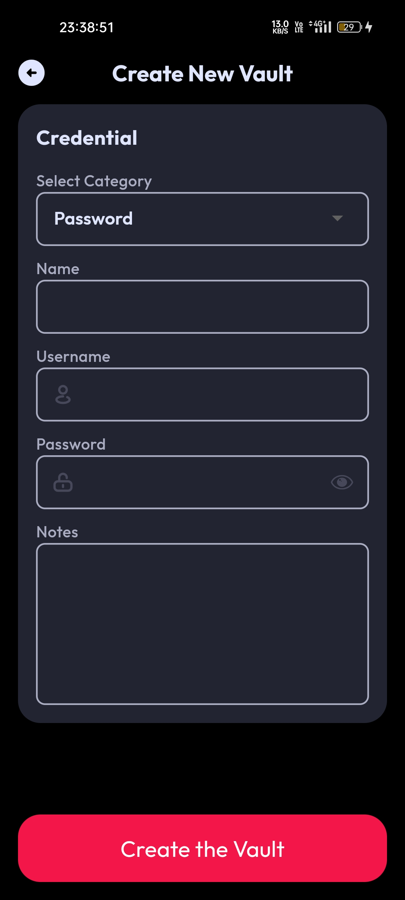
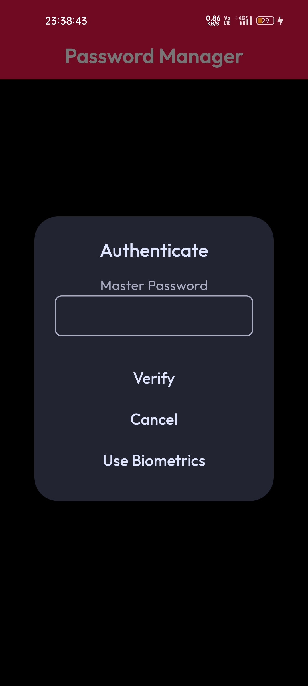

# Vaultify - Password Manager 🔐

## Description
Vaultify is a secure and user-friendly password manager built using Flutter and Firebase. It allows you to store and manage your passwords, bank account details, ATM card information, and personal notes securely in an encrypted vault.

## Features ✨
- **Create Accounts & Login**: Easily create an account and login to manage your vault. 🔓
- **Set Profile Pic as Avatar**: Choose an avatar from a predefined set or upload your own profile picture. 🖼️
- **Manage Vault Items**: Create, edit, and delete vault items effortlessly. 🗂️
- **Categorization**: Organize your vault items into categories such as Passwords, Bank Accounts, ATM Cards, and Notes. 📂
- **Generate Password**: Implement a feature to generate strong and secure passwords. 🔑
- **Copy Functionality**: Copy usernames and passwords with a single tap. 📋
- **Encrypted Storage**: Stores all your vault items in encrypted form using AES encryption to ensure maximum security. 🔒
- **Biometric Authentication**: Use fingerprint or face recognition to access your vault quickly and securely. 👆
- **Screenshot Blocking**: Prevent screenshots from being taken within the app to enhance privacy. 🚫📸
- **Dark Mode**: Supports dark mode to reduce eye strain. 🌙

## Todo 📝
- **Autofill**: Enable autofill functionality for seamless login experiences. 📝
- **Share Vaults**: Allow users to share vault items securely with others. 🔗
- **Social Sign Up**: Integrate sign-up options with Google, Facebook, and Apple for easier access. 🌐

## Screenshots 📸

### Light Mode
|  |  |  |  |  |  |
| --- | --- | --- | --- | --- | --- |
|  |  |  |  |  |   |

### Dark Mode
|  |  |  |  |  |  |
| --- | --- | --- | --- | --- | --- |
|  |  |  |  |  |   |

## Installation ⚙️
To get started with Vaultify, follow these steps:

1. **Clone the Repository**
   ```
   git clone https://github.com/alvarule/vaultify.git
   cd vaultify
   ```

2. **Install Dependencies**
    ```
    flutter pub get
    ```
    
3. **Run the App**
    ```bash
    flutter run -d <device_id>
    ```

    To get the `device_id`:
    ```bash
    flutter devices
    ```

For any issues, please contact me at [athrvarule@gmail.com](mailto:athrvarule@gmail.com). 📧


Feel free to contribute to the project by submitting issues or pull requests. Happy coding! 🎉
